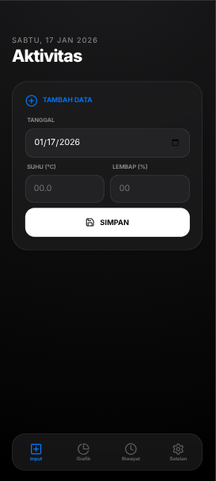
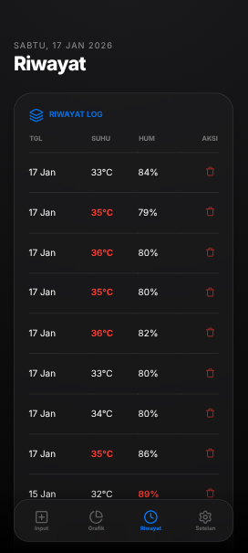
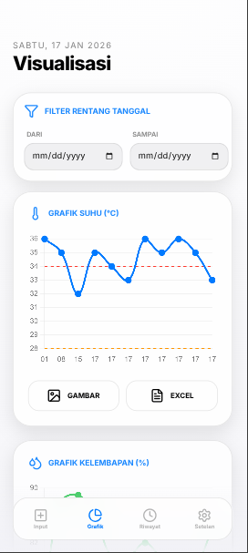
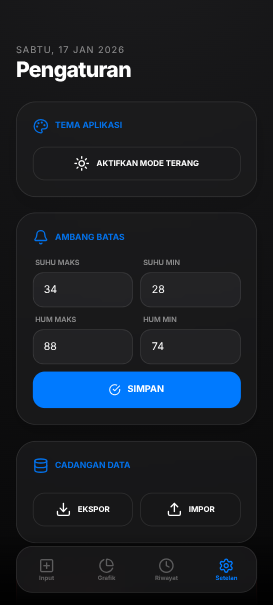
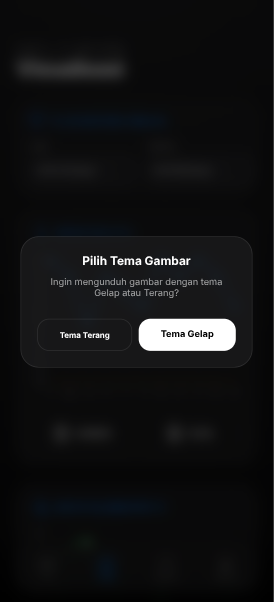

# 🌡️ ThermoHub - Monitoring Suhu & Kelembapan

**ThermoHub** adalah aplikasi web progresif (PWA-ready) yang dirancang untuk mencatat, memantau, dan memvisualisasikan data suhu (°C) serta kelembapan (%). Dibangun dengan antarmuka modern ala iOS yang responsif, aplikasi ini memudahkan pengguna untuk mengelola log data lingkungan secara lokal menggunakan *localStorage*.

---

## 📸 Preview Aplikasi

Berikut adalah tampilan antarmuka ThermoHub yang dioptimalkan untuk perangkat seluler:

| 1. Input Data | 2. Grafik Tren | 3. Riwayat Log |
| :---: | :---: | :---: |
|  |  |  |
| Antarmuka input intuitif dengan validasi data suhu dan kelembapan. | Visualisasi interaktif menggunakan Chart.js lengkap dengan garis ambang batas. | Log data historis dengan indikator peringatan warna merah jika melebihi batas. |

| 4. Mode Terang | 5. Setelan & Ambang Batas | 6. Ekspor Data |
| :---: | :---: | :---: |
|  |  |  |
| Dukungan tema terang untuk penggunaan di bawah sinar matahari. | Konfigurasi batas suhu/kelembapan dan manajemen database (Impor/Ekspor JSON). | Fitur ekspor laporan ke format Excel (.xlsx) dan gambar (.png). |

---

## ✨ Fitur Utama

* **Pencatatan Data Cepat:** Input tanggal, suhu, dan kelembapan dengan validasi otomatis.
* **Visualisasi Grafik Interaktif:** Grafik garis menggunakan `Chart.js` untuk melihat tren suhu dan kelembapan secara real-time.
* **Sistem Ambang Batas (Threshold):** Tandai data yang melebihi batas maksimal atau di bawah batas minimal dengan indikator warna bahaya.
* **Ekspor & Impor:**
    * Unduh grafik sebagai gambar (PNG) dengan pilihan tema.
    * Ekspor data ke format Excel (`.xlsx`) baik secara terpisah maupun gabungan.
    * Cadangkan dan pulihkan database melalui file JSON.
* **Mode Gelap & Terang:** UI adaptif yang nyaman di mata dengan transisi halus.
* **Navigasi Gesture:** Mendukung *swipe gesture* untuk berpindah antar halaman layaknya aplikasi mobile asli.

---

## 👤 Kredit

Dibuat oleh **IT AGV**.

---

## 📜 Lisensi

Proyek ini tersedia untuk digunakan secara bebas (Open Source).
